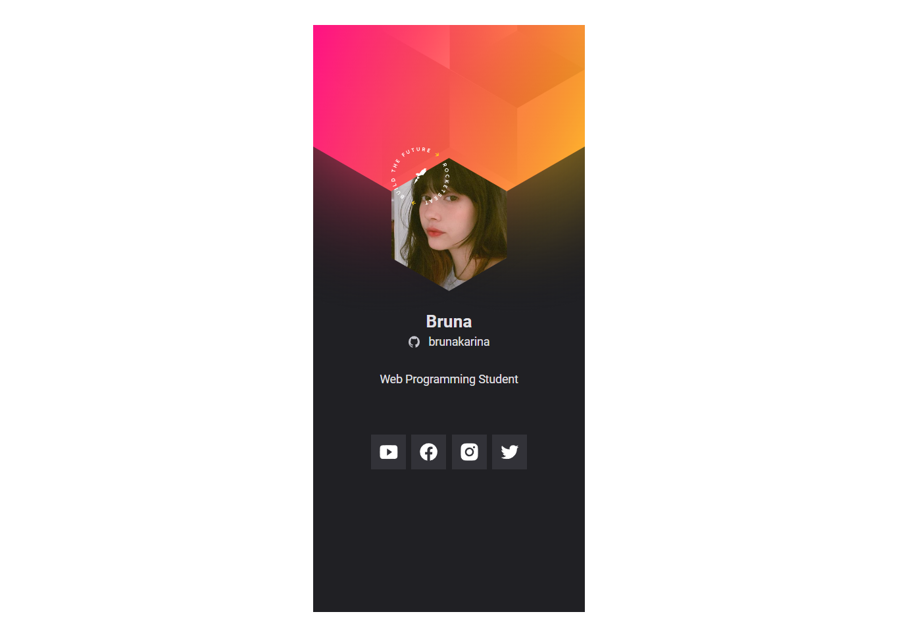

# Crachá Virtual DoWhile

> 🚀 Tecnologias

Esse projeto foi desenvolvido com as seguintes tecnologias:

- HTML
- CSS
- JavaScript

> 💻 Projeto

O Crachá virtual DoWhile é uma aplicação estática com o objetivo de mostrar as informações do usuário trazidas do GitHub API e inseri-las em um layout com a cara do evento DoWhile 2021.

> 🔗 [Clique aqui para acessar](https://brunakarina.github.io/cracha-nlw/)

## 💙 Contato

brubskarina@gmail.com